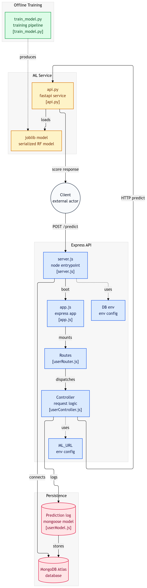

# 🛡️ Fraud Guard

A production-ready **Credit Card Fraud Detection API** that combines a Machine Learning model with a scalable backend architecture. Built with **FastAPI** (ML inference), **Express.js** (REST API), and **MongoDB** (prediction logging).

---

## 🏗️ Architecture

### Flow Overview
Client → Express API → FastAPI ML Service → Model → MongoDB

### System Diagram

<p align="center">
  
</p>

---

## ⚙️ Tech Stack

| Layer               | Technology                   |
| ------------------- | ---------------------------- |
| REST API            | Node.js, Express.js          |
| ML Service          | Python, FastAPI, Uvicorn     |
| ML Model            | Scikit-learn (Random Forest) |
| Database            | MongoDB Atlas, Mongoose      |
| Data Processing     | NumPy, Pandas                |
| Model Serialization | Joblib                       |
| Deployment          | Render (two services)        |

---

## 🤖 Machine Learning

### Dataset

- **Source:** [Kaggle Credit Card Fraud Detection](https://www.kaggle.com/datasets/mlg-ulb/creditcardfraud)
- **Size:** 284,807 transactions, 492 fraud cases (~0.17% positive class)
- **Features:** 30 features — `Time`, `V1–V28` (PCA-transformed), `Amount`

### Models Evaluated

| Model                | Notes                                             |
| -------------------- | ------------------------------------------------- |
| Logistic Regression  | Baseline with StandardScaler pipeline             |
| XGBoost              | Tuned with `scale_pos_weight` for class imbalance |
| Neural Network       | Keras sequential model with class weights         |
| **Random Forest** ✅ | **Final model — best recall/precision tradeoff**  |

### Why Random Forest?

The dataset is highly imbalanced (fraud is ~0.17% of transactions). Random Forest with `class_weight="balanced"` and a tuned decision threshold of **0.3** achieved the best tradeoff between catching fraud (recall) and avoiding false positives (precision).

### Model Evaluation

- 5-fold **Stratified Cross Validation** on recall
- Threshold tuning across `[0.3, 0.5, 0.7]`
- Metrics: Confusion Matrix, Classification Report

---

## 🚀 API Endpoints

### Express.js (Port 3001)

| Method   | Endpoint    | Description                              |
| -------- | ----------- | ---------------------------------------- |
| `POST`   | `/predict`  | Run fraud prediction on transaction data |
| `GET`    | `/logs`     | Fetch all prediction logs (paginated)    |
| `GET`    | `/logs/:id` | Fetch a single prediction log by ID      |
| `PATCH`  | `/logs/:id` | Update a prediction log                  |
| `DELETE` | `/logs/:id` | Delete a prediction log                  |

### FastAPI (Port 8000)

| Method | Endpoint   | Description                                      |
| ------ | ---------- | ------------------------------------------------ |
| `POST` | `/predict` | Accepts transaction features, returns risk score |
| `GET`  | `/docs`    | Auto-generated Swagger UI                        |

---

## 📦 Predict Request & Response

### Request Body

```json
{
  "Time": 0,
  "V1": -1.35,
  "V2": -0.07,
  "V3": 2.53,
  "V4": 1.37,
  "V5": -0.33,
  "V6": 0.46,
  "V7": 0.23,
  "V8": 0.09,
  "V9": 0.36,
  "V10": 0.09,
  "V11": -0.55,
  "V12": -0.61,
  "V13": -0.99,
  "V14": -0.31,
  "V15": 1.46,
  "V16": -0.47,
  "V17": 0.2,
  "V18": 0.02,
  "V19": 0.4,
  "V20": 0.25,
  "V21": -0.01,
  "V22": 0.27,
  "V23": -0.11,
  "V24": 0.06,
  "V25": 0.12,
  "V26": -0.18,
  "V27": 0.13,
  "V28": -0.02,
  "Amount": 149.62
}
```

### Response

```json
{
  "status": "success",
  "data": {
    "request_id": "a1b2c3d4-...",
    "risk_score": 0.87,
    "decision": "high_risk",
    "threshold": 0.3
  }
}
```

---

## 🗂️ Project Structure

```
fraud_guard/
├── controllers/
│   └── userController.js    # Business logic, calls FastAPI, logs to DB
├── routers/
│   └── userRouter.js        # Express route definitions
├── models/
│   └── userModel.js         # Mongoose schema for prediction logs
├── api.py                   # FastAPI app — loads model, runs inference
├── app.js                   # Express app setup, middleware
├── server.js                # Entry point, DB connection
├── train_model.py           # ML training script (all 4 models)
├── model_credit_card.joblib # Serialized Random Forest model
├── package.json
├── package_lock.json
├── requirements.txt
└── .gitignore
```

---

## 🛠️ Local Setup

### Prerequisites

- Node.js v18+
- Python 3.9+
- MongoDB Atlas account

### 1. Clone the repo

```bash
git clone https://github.com/vinayak251104/fraud_guard_api.git
cd fraud_guard_api
```

### 2. Install Node dependencies

```bash
npm install
```

### 3. Install Python dependencies

```bash
pip install -r requirements.txt
```

### 4. Set up environment variables

Create a `config.env` file in the root:

```
PORT=3001
DATABASE=mongodb+srv://<username>:<PASSWORD>@cluster.mongodb.net/fraud_guard
DATABASE_PASSWORD=your_password
ML_URL=http://127.0.0.1:8000
```

### 5. Start FastAPI

```bash
uvicorn api:app --host 127.0.0.1 --port 8000
```

### 6. Start Express

```bash
node server.js
```

---

## ☁️ Deployment (Render)

Two separate web services on [Render](https://render.com):

| Service           | Runtime  | Build Command                     | Start Command                                 |
| ----------------- | -------- | --------------------------------- | --------------------------------------------- |
| `fraud-guard-ml`  | Python 3 | `pip install -r requirements.txt` | `uvicorn api:app --host 0.0.0.0 --port $PORT` |
| `fraud-guard-api` | Node     | `npm install`                     | `node server.js`                              |

Environment variables set on Render for the Express service:

- `ML_URL` → URL of the deployed FastAPI service
- `DATABASE` → MongoDB Atlas connection string
- `DATABASE_PASSWORD` → Atlas password

---
## 🌐 Live Demo

| Service | URL |
|---|---|
| **Express REST API** | https://fraud-guard-express.onrender.com |
| **FastAPI ML Service** | https://fraud-guard-api-zxhk.onrender.com |
| **FastAPI Swagger UI** | https://fraud-guard-api-zxhk.onrender.com/docs |

> ⚠️ Hosted on Render's free tier — the first request may take up to 50 seconds to wake up the services.

## 👤 Author

Made by **Vinayak Ray** — [GitHub](https://github.com/vinayak251104)
